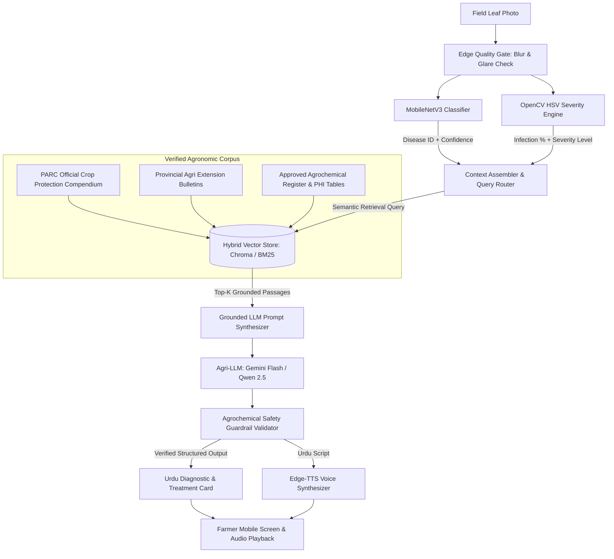
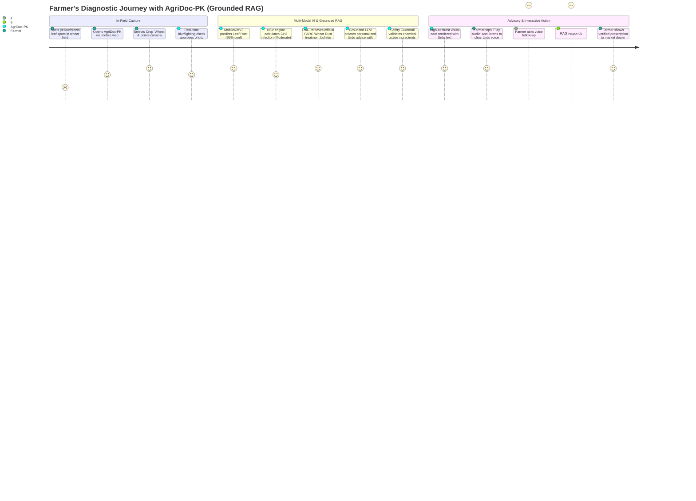
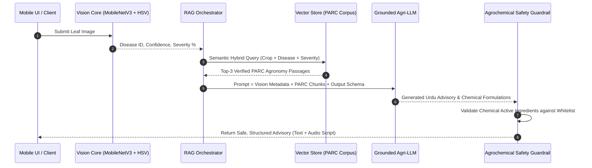
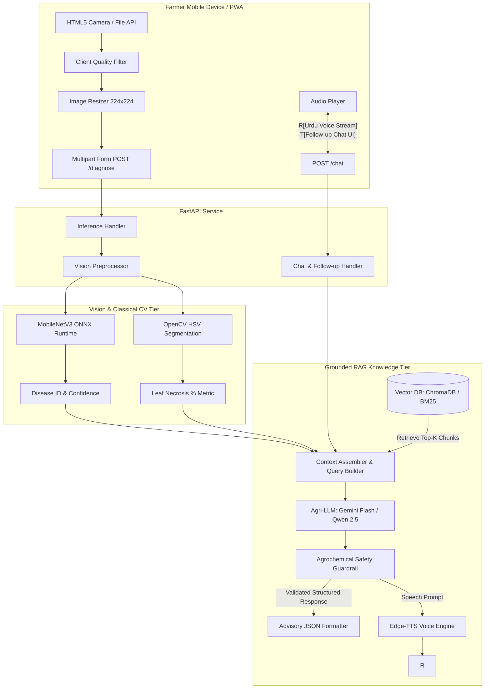
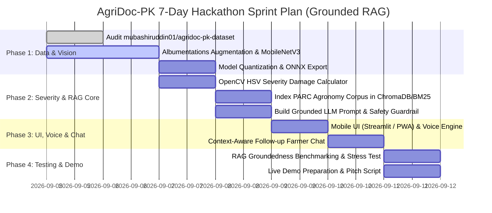

# Product Requirements Document (PRD)

---

## Document Information

| Attribute | Details |
| :--- | :--- |
| **Project Name** | **AgriDoc-PK (Smart Agriculture & Grounded RAG Urdu Advisory)** |
| **Target Hackathon** | Bano Qabil AI Hackathon (in partnership with Alibaba Cloud & Alkhidmat Foundation) |
| **Domain Tracks** | Smart Agriculture / Urdu & Regional AI Technology / Generative AI & Edge Systems |
| **Primary Dataset** | `mubashiruddin01/agridoc-pk-dataset` |
| **Team Members** | Mubashir Uddin (AI/ML Engineer & Systems Architect), Saad Mustafa (Workflow Manager), Dheeraj Khatri (Data Engineer) |
| **Document Version** | `v2.0.0-PROD` (Updated: Grounded LLM / Hybrid RAG Architecture) |
| **Status** | Approved for Execution / Hackathon Ready |
| **Classification** | Technical Product Specification & Engineering Blueprint |

---

## 1. Executive Summary & Vision

### 1.1 Problem Statement
Pakistan’s agricultural sector contributes roughly 23% to national GDP and employs over 37% of the labor force. However, smallholder farmers (cultivating under 12.5 acres) suffer annual yield losses between **25% and 40%** due to preventable plant diseases and insect vectors—most notably **Leaf Rust in Wheat**, **Cotton Leaf Curl Virus (CLCuV)**, and **Rice Blast**.

The root bottlenecks in Pakistani rural agronomy are:
1. **The Extension Bottleneck**: The current ratio of government agricultural extension workers to farming families in Pakistan exceeds **1:3,500**. Diagnostic help arrives days or weeks after symptoms emerge, often post-epidemic.
2. **Indiscriminate Agrochemical Overuse**: Lacking real-time pathology expertise, farmers rely on guesswork or commercial pesticide dealers. They frequently apply inappropriate, broad-spectrum chemicals (e.g., spraying pyrethroids for fungal infections), causing crop burning, pathogen resistance, soil degradation, and severe household debt.
3. **The Technical & Linguistic Literacy Barrier**: Standard extension literature is distributed in English or high-register technical Urdu pamphlets. Over 60% of rural farm operators require spoken, dialect-accessible instructions.
4. **The "Lab vs. Wild" AI Domain Gap**: Existing academic crop disease apps trained on clean studio photos (e.g., PlantVillage) fail in real Pakistani farm environments characterized by high-glare sunlight, dust, shadows, and partial leaf occlusions.
5. **Static Advice Inflexibility**: Purely hardcoded rulebooks cannot handle complex farmer situations (e.g., weather constraints, organic budget limits, follow-up clarification questions, or alternative pesticide brand availability). Conversely, raw, ungrounded generative LLMs hallucinate dangerous chemical concentrations.

### 1.2 Proposed Solution: AgriDoc-PK (Hybrid Vision + Grounded RAG)
**AgriDoc-PK** is an edge-compatible, multi-modal diagnostic and decision-support system designed specifically for Pakistan’s agricultural landscape. It bridges computer vision and retrieval-augmented generation:
1. **Visual Quality Gate**: Pre-validates camera input, filtering out blurry or non-foliar uploads on the device.
2. **Vision Core (CNN)**: Classifies the crop and disease in $< 150 \text{ ms}$ using a quantized **MobileNetV3-Small** trained on `mubashiruddin01/agridoc-pk-dataset`.
3. **Quantitative Severity Engine**: Computes exact leaf surface necrotic damage via OpenCV HSV morphological segmentation into a 3-tier severity index (**Mild**, **Moderate**, **Severe**).
4. **Grounded LLM Advisory (Hybrid RAG)**: Rather than relying on rigid static dictionaries or hallucination-prone unconstrained LLMs, AgriDoc-PK utilizes a **Retrieval-Augmented Generation (RAG)** pipeline. Verified agronomy corpora from the **Pakistan Agricultural Research Council (PARC)** and provincial extension departments are indexed in a high-speed vector store. An agronomic LLM synthesizes tailored, conversational, yet clinically grounded treatment plans with strict safety guardrails.
5. **Multilingual Voice (TTS)**: Translates the grounded advice into natural spoken Urdu audio alongside high-contrast visual cards.



### 1.3 Value Proposition & Success Metrics (OKRs)

| Metric | Target Baseline (Hackathon) | Production Scale Goal |
| :--- | :--- | :--- |
| **Diagnostic Accuracy (Top-1)** | $\ge 92.0\%$ on test split | $\ge 96.5\%$ across variable field lighting |
| **End-to-End Latency** | $< 2.2 \text{ s}$ (Vision + RAG + Audio) | $< 1.2 \text{ s}$ on optimized serverless edge |
| **RAG Retrieval Precision (@k=3)** | $\ge 95.0\%$ relevant PARC chunks | $\ge 98.5\%$ with hybrid dense/sparse reranking |
| **Dosage Hallucination Rate** | **$0.00\%$** (Deterministic guardrail validation) | **$0.00\%$** |
| **RAG Faithfulness Score (RAGAS)** | $\ge 0.92$ (Strict grounding in retrieved context) | $\ge 0.98$ |
| **Voice Playback Usability** | 1-tap playback without text input | Offline pre-cached synthesis in Urdu & Sindhi |

---

## 2. Bano Qabil & Alibaba Cloud Alignment Matrix

| Hackathon Criterion | AgriDoc-PK Implementation | Judge Evaluation Impact |
| :--- | :--- | :--- |
| **Track Relevance** | Dual-track synergy: **Smart Agriculture** + **Urdu & Regional Tech**. Directly protects Pakistan’s foundational crops (Wheat, Cotton, Rice). | Direct score maximization on core theme match. |
| **Local Social Impact** | Democratizes agricultural consulting, eliminates pesticide dealer exploitation, prevents crop burn, and removes literacy barriers. | Maximum score in Community & Economic Impact. |
| **Technical Innovation** | Advanced Hybrid AI: Edge Computer Vision (CNN) + Classical Mathematical CV (HSV segmentation) + **Grounded RAG (Vector Search + LLM)** + Agrochemical Guardrails + Neural TTS. | Positions the project at the frontier of applied Generative AI and MLOps. |
| **Viability & Scalability** | Low-cost architecture: Lightweight CNN + efficient vector retriever + cloud LLM API. Deployable on Alibaba Cloud Linux / Hugging Face Spaces with instant QR demo. | Eliminates judge onboarding friction (no bulky mobile install required). |

---

## 3. User Personas & Journey Mapping

### 3.1 User Personas

#### Persona 1: Chaudhry Bashir (Primary User - Smallholder Farmer)
* **Demographics**: 48 years old, Sheikhupura (Punjab). Manages 4 acres of wheat and rice.
* **Tech Literacy**: Low literacy in English and formal Urdu. Uses a budget Android smartphone (Android 10 Go Edition, 2GB RAM).
* **Environment**: Direct sunlight, low-bandwidth 3G, muddy field conditions.
* **Pain Point**: Cannot read complex chemical leaflets; vulnerable to pesticide dealers selling wrong chemicals.
* **User Goal**: Points camera at a rust-spotted leaf, receives immediate voice advice in Urdu, and can ask one-tap spoken follow-up questions (*"What if rain is expected tonight?"*).

#### Persona 2: Dr. Ayesha Siddiqui (Secondary User - Field Extension Officer)
* **Demographics**: 29 years old, Tandojam (Sindh). Covers 18 rural union councils.
* **Tech Literacy**: High. Uses a modern smartphone.
* **Pain Point**: Cannot personally visit 5,000+ farms during sudden locust or virus epidemics.
* **User Goal**: Rapid triage tool with quantitative damage assessment (% leaf infection) and instant, verifiable PARC literature citations.

---

### 3.2 User Journey Map



---

## 4. Product Scope & Functional Requirements (FR)

### Module Breakdown Architecture

```
┌────────────────────────────────────────────────────────────────────────┐
│                        AGRIDOC-PK CORE MODULES                         │
├───────────────────┬───────────────────┬────────────────────────────────┤
│ [M1] Ingestion    │ [M2] Vision Core  │ [M3] Quantitative Severity     │
│  - Camera / File  │  - MobileNetV3    │  - HSV Color Segmentation      │
│  - Quality Filter │  - PyTorch / ONNX │  - Infection % & Triage Matrix │
├───────────────────┴───────────────────┴────────────────────────────────┤
│ [M4] Grounded LLM Advisory Engine (Hybrid RAG)                         │
│  - PARC Agronomic Knowledge Base & Vector Index (Chroma / FAISS)      │
│  - Multi-Modal Context Assembler (Disease + Severity + Location)       │
│  - Grounded Agronomy LLM (Gemini Flash / Qwen 2.5)                     │
│  - Post-Generation Agrochemical Safety Guardrail                       │
├───────────────────────────────────────┬────────────────────────────────┤
│ [M5] Multilingual Voice Engine (TTS)  │ [M6] Interactive Farmer Chat   │
│  - Neural Urdu Speech Synthesizer     │  - Context-Aware Q&A Follow-up │
│  - Client Audio Cache                 │  - Voice/Text Query Handling   │
└───────────────────────────────────────┴────────────────────────────────┘
```

---

### 4.1 Module 1: Image Ingestion & Edge Quality Gate

* **FR-1.1 Input Modalities**: Hardware rear camera streaming and direct file uploads (`.jpg`, `.jpeg`, `.png`, `.webp`).
* **FR-1.2 Client-Side Resizing**: Automatic scaling to maximum $1024 \times 1024 \text{ px}$ before upload to maintain $< 300 \text{ KB}$ network payload.
* **FR-1.3 Blur Detection Gate**: Compute Laplacian variance $\sigma^2 = \text{Var}\left(\nabla^2 I\right)$. If $\sigma^2 < 100.0$, reject image and display:  
  *«تصویر واضح نہیں ہے۔ کیمرہ ساکت رکھ کر دوبارہ تصویر بنائیں۔»*
* **FR-1.4 Exposure Gate**: Calculate mean luminance $\mu_{gray} \in [0, 255]$. Reject images with $\mu_{gray} < 40$ (underexposed) or $\mu_{gray} > 225$ (sun glare wash).

---

### 4.2 Module 2: Multi-Crop Disease Classifier (Vision Core)

* **FR-2.1 Supported Classes & Taxonomies**: Trained on `mubashiruddin01/agridoc-pk-dataset`:

| Crop Category | Scientific Class Identifier | Vernacular Urdu Label | Pathogen Type |
| :--- | :--- | :--- | :--- |
| **Wheat (گندم)** | `wheat_healthy` | صحت مند گندم | N/A (Control) |
| **Wheat (گندم)** | `wheat_leaf_rust` | بھوری زنگاری (*Puccinia triticina*) | Fungal |
| **Wheat (گندم)** | `wheat_stripe_rust` | زرد زنگاری (*Puccinia striiformis*) | Fungal |
| **Wheat (گندم)** | `wheat_loose_smut` | گندم کا سمٹ (*Ustilago tritici*) | Fungal |
| **Cotton (کپاس)** | `cotton_healthy` | صحت مند کپاس | N/A (Control) |
| **Cotton (کپاس)** | `cotton_leaf_curl_virus` | مڑوریا وائرس (CLCuV - سفید مکھی) | Viral Vector |
| **Cotton (کپاس)** | `cotton_bacterial_blight` | کپاس کا جھلساؤ (*Xanthomonas*) | Bacterial |
| **Rice (چاول/دھان)** | `rice_healthy` | صحت مند چاول | N/A (Control) |
| **Rice (چاول/دھان)** | `rice_blast` | دھان کا بلاسٹ / جھلساؤ (*Magnaporthe oryzae*) | Fungal |
| **Rice (چاول/دھان)** | `rice_brown_spot` | چاول کے بھورے دھبے (*Bipolaris oryzae*) | Fungal |

* **FR-2.2 Out-of-Distribution (OOD) Guard**: If maximum softmax probability is $< 65.0\%$, trigger fallback without hallucinating a false diagnosis:  
  *«پتے کی بیماری کی تصدیق نہیں ہو سکی۔ براہ کرم صاف تصویر دوبارہ لیں۔»*
* **FR-2.3 Model Backbone**: Pretrained **MobileNetV3-Small** fine-tuned on PyTorch and exported to quantized INT8 ONNX format.

---

### 4.3 Module 3: Quantitative Severity Assessment Engine

* **FR-3.1 Algorithmic Damage Quantification**:
  1. Convert BGR image to HSV color space: $I_{HSV} = \text{cvtColor}(I_{BGR}, \text{COLOR\_BGR2HSV})$.
  2. Segment total leaf area ($M_{leaf}$) using morphological masks for green, yellow, and brown vegetative tissue.
  3. Segment necrotic/chlorotic lesions ($M_{lesion}$) capturing rust pustules, viral chlorosis, and blight spots.
  4. Compute surface damage:
     $$S_{pct} = \left(\frac{\sum_{(x,y)} M_{lesion}(x, y)}{\sum_{(x,y)} M_{leaf}(x, y)}\right) \times 100\%$$
* **FR-3.2 Triage Classification**:
  * **Mild ($S_{pct} < 10\%$)**: Localized spot management, organic preventative bio-fungicide, or cultural controls.
  * **Moderate ($10\% \le S_{pct} \le 30\%$)**: Curative chemical fungicide/insecticide application recommended within 48 hours.
  * **Severe ($S_{pct} > 30\%$)**: Emergency containment, quarantine spraying to protect adjacent acres, soil drenches.

---

### 4.4 Module 4: Grounded LLM Advisory Engine (Hybrid RAG)

Unlike static databases that cannot adapt or raw LLMs that invent hazardous chemical dosages, AgriDoc-PK employs a **Grounded Hybrid RAG Architecture**:



#### FR-4.1 Verified Agronomic Corpus & Vector Store
* **Corpus Sources**:
  1. *Pakistan Agricultural Research Council (PARC)*: Crop pathology advisories.
  2. *Punjab & Sindh Agricultural Extension Departments*: Approved pest management compendiums.
  3. *Federal Department of Plant Protection (DPP)*: Registered pesticides, banned chemicals list, and Pre-Harvest Intervals (PHI).
* **Chunking & Indexing**:
  * Documents split into semantic chunks of $350 \text{ tokens}$ with a $50 \text{ token}$ overlap.
  * Vector Store: Lightweight local ChromaDB or FAISS index using multilingual sentence embeddings (`sentence-transformers/paraphrase-multilingual-MiniLM-L12-v2` or `text-embedding-3-small`).
  * Hybrid Retrieval: Dense vector similarity combined with BM25 keyword matching for exact chemical name retrieval.

#### FR-4.2 Multi-Modal Context Assembly & Dynamic Prompting
The RAG Orchestrator synthesizes the prompt injecting:
1. Exact Vision Model Outputs (Crop name, classified disease, classification confidence).
2. Quantified Severity Metric (Infection percentage, triage severity level).
3. Top-$K$ retrieved authoritative chunks from the PARC knowledge base.
4. Strict system instruction rules (Anti-hallucination constraint, language format, dosage limits).

#### FR-4.3 Grounded LLM Generation
* **Model Engine**: Low-latency, cost-effective multimodal LLM (**Gemini 1.5 Flash** or local quantized **Qwen-2.5-7B-Instruct**).
* **Execution Mode**: Strict JSON schema enforcement ensuring deterministic structure containing:
  * `disease_explanation_ur`: Plain, empathetic Urdu explanation.
  * `recommended_chemical`: Brand name, active ingredient, concentration, dose per acre, application instructions.
  * `desi_organic_alternative`: Readily available household/organic remedy.
  * `prevention_and_cultural_control`: Irrigation, spacing, and pruning guidelines.
  * `citations`: Official PARC document names referenced.

#### FR-4.4 Post-Generation Agrochemical Safety Guardrail
* To guarantee **$0.00\%$ chemical dosage hallucination**, a deterministic validator checks every chemical recommendation in the LLM output:
  * Cross-checks active ingredients against the official PARC Approved Agrochemical Whitelist (`parc_whitelist.json`).
  * Asserts maximum allowable concentration per acre (e.g., Nativo $\le 65 \text{ g/acre}$, Amistar Top $\le 200 \text{ ml/acre}$).
  * If the LLM generates an unapproved chemical or out-of-bounds dosage, the guardrail instantly overrides the chemical section with the verified baseline record, flagging the event in the system audit log.

---

### 4.5 Module 5: Multilingual Urdu Voice Engine (TTS)

* **FR-5.1 Speech Synthesis**: Integration with high-fidelity neural Urdu speech models (`edge-tts` utilizing `ur-PK-AsadNeural` or `ur-PK-UzmaNeural`).
* **FR-5.2 Oral Formulation**: The grounded advisory engine outputs a dedicated, clean, conversational Urdu speech script ($< 35 \text{ words}$) designed for high acoustic clarity through cheap phone speakers.
* **FR-5.3 Client-Side Audio Caching**: Audio streams are transferred as lightweight `.mp3` blobs and cached locally to prevent repeated bandwidth consumption.

---

### 4.6 Module 6: Interactive Farmer Follow-up Q&A (Context-Aware RAG)

* **FR-6.1 Conversational Extension**: After the initial diagnosis, the farmer can ask contextual follow-up questions via text or voice input:
  * *Example 1*: «کیا میں بارش سے پہلے یہ اسپرے کر سکتا ہوں؟» (*Can I spray before rain?*)
  * *Example 2*: «میرے پاس نیٹیوو نہیں ہے، کوئی اور متبادل دوا بتائیں۔» (*I don't have Nativo, suggest an alternative.*)
* **FR-6.2 Context-Preserved RAG**: The conversation session maintains the leaf’s diagnosed state (`disease_id`, `severity_pct`) and performs secondary retrieval over the PARC corpus to answer the farmer's specific query without losing diagnostic context.

---

## 5. UI/UX Design & Field Ergonomics

### 5.1 Design Constraints for Rural Outdoor Usability
1. **Sunlight Contrast Ratio**: 
   * Primary Background: Clean Pearl White (`#F8F9FA`) and High-Contrast Forest Green (`#1B4332`).
   * Text & Borders: High-visibility Deep Charcoal (`#111827`), avoiding light gray text.
   * Severe Alerts: Vivid Crimson Red (`#D90429`).
2. **Ergonomic Calloused-Hand Targets**: All interactive elements (camera buttons, tabs, audio controls) must have a minimum hit target of **$54 \times 54 \text{ px}$** with at least $12 \text{ px}$ padding between adjacent triggers.
3. **Zero-Typing Philosophy**: The primary diagnostic flow must be completed in **2 taps** (Tap 1: Capture Photo $\rightarrow$ Tap 2: Hear Urdu Audio).

---

### 5.2 Mobile Wireframe Specification (With Grounded RAG & Follow-up Q&A)

```
┌──────────────────────────────────────────────────┐
│  🌿 AgriDoc-PK | ایگری ڈاک پاکستان               │
│  Bano Qabil AI Hackathon Prototype               │
├──────────────────────────────────────────────────┤
│                                                  │
│  [ گندم (Wheat) ]  [ کپاس (Cotton) ]  [ چاول ]   │
│                                                  │
│  ┌────────────────────────────────────────────┐  │
│  │                                            │  │
│  │             [ 📷 کیمرہ کھولیں ]            │  │
│  │                                            │  │
│  │        پتے کو کیمرے کے سامنے رکھیں          │  │
│  │                                            │  │
│  └────────────────────────────────────────────┘  │
│                                                  │
│         [ 📁 گیلری سے تصویر منتخب کریں ]         │
│                                                  │
├──────────────────────────────────────────────────┤
│             AI DIAGNOSIS & RAG ADVISORY          │
│                                                  │
│  🌾 فصل: گندم (Wheat)                            │
│  ⚠️ تشخیص: Leaf Rust (پتوں کی بھوری زنگاری)      │
│  📊 بیماری کی شدت: 24% [ درمیانی نقصان ]          │
│  📚 مصدقہ ماخذ: PARC Wheat Advisory 2024         │
│                                                  │
│  ┌────────────────────────────────────────────┐  │
│  │      🔊  آواز میں ہدایت سنیں (PLAY URDU)    │  │
│  └────────────────────────────────────────────┘  │
│                                                  │
│  [ تجویز کردہ اسپرے ]    [ دیسی قدرتی علاج ]     │
│  ┌────────────────────────────────────────────┐  │
│  │ • Nativo 75 WG (Tebuconazole + Triflox.)   │  │
│  │ • مقدار: 65 گرام فی 100 لیٹر پانی فی ایکڑ  │  │
│  │ • وقت: صبح سویرے شبنم خشک ہونے پر اسپرے کریں│  │
│  │ • احتیاط: فصل کاٹنے سے 21 دن پہلے اسپرے بند│  │
│  └────────────────────────────────────────────┘  │
│                                                  │
│  💬 مزید سوال پوچھیں (Follow-up Q&A):            │
│  ┌────────────────────────────────────────────┐  │
│  │ [ 🎤 سوال بولیں ]  یا  [ یہاں سوال لکھیں ] │  │
│  └────────────────────────────────────────────┘  │
└──────────────────────────────────────────────────┘
```

---

## 6. Technical & System Architecture

### 6.1 End-to-End System Block Diagram



---

### 6.2 Data Flow & Normalization Specification

1. **Input Tensor Preprocessing**:
   $$\mathbf{X}_{raw} \in \mathbb{R}^{H \times W \times 3} \xrightarrow{\text{Resize}} \mathbb{R}^{224 \times 224 \times 3} \xrightarrow{\text{ToTensor}} \mathbb{R}^{3 \times 224 \times 224} \in [0.0, 1.0]$$
2. **Channel-wise Normalization**:
   $$\mu = [0.485, 0.456, 0.406], \quad \sigma = [0.229, 0.224, 0.225]$$
   $$\mathbf{X}_{norm}^{(c)} = \frac{\mathbf{X}^{(c)} - \mu^{(c)}}{\sigma^{(c)}}$$
3. **Inference Execution**:
   $$\mathbf{z} = f_{\mathbf{W}}(\mathbf{X}_{norm}) \in \mathbb{R}^{C}, \quad \hat{y} = \text{argmax}(\text{softmax}(\mathbf{z}))$$

---

### 6.3 API Contract Specifications

#### 1. `POST /api/v1/diagnose`
* **Content-Type**: `multipart/form-data`
* **Parameters**:
  * `file`: Leaf image binary (`image/jpeg` or `image/png`).
  * `crop_hint` (Optional): String (`wheat`, `cotton`, `rice`, `auto`).
  * `language` (Optional): String default `ur` (Urdu).

* **Response Payload (JSON `200 OK`)**:
```json
{
  "status": "success",
  "meta": {
    "total_latency_ms": 1420.5,
    "vision_latency_ms": 115.2,
    "rag_latency_ms": 840.1,
    "tts_latency_ms": 465.2,
    "model_version": "mobilenetv3_agridoc_v2_int8"
  },
  "diagnosis": {
    "crop": "Wheat",
    "crop_ur": "گندم",
    "disease_id": "wheat_leaf_rust",
    "disease_name": "Leaf Rust (Brown Rust)",
    "disease_name_ur": "پتوں کی بھوری زنگاری",
    "confidence": 0.9542,
    "pathogen": "Puccinia triticina (Fungal)"
  },
  "severity": {
    "infected_percentage": 23.6,
    "level": "Moderate",
    "level_ur": "درمیانی نقصان",
    "urgency": "Action required within 48 hours"
  },
  "grounded_advisory": {
    "summary_ur": "آپ کی گندم کی فصل میں پتے کی بھوری زنگاری کی تصدیق ہوئی ہے، نقصان 24 فیصد ہے۔ فوری حفاظتی اسپرے ضروری ہے۔",
    "chemical_treatment": {
      "product_name": "Nativo 75 WG",
      "active_ingredient": "Tebuconazole 50% + Trifloxystrobin 25%",
      "dosage_per_acre": "65 grams per 100 liters of water",
      "dosage_ur": "65 گرام فی 100 لیٹر پانی فی ایکڑ",
      "spray_timing_ur": "صبح کے وقت شبنم خشک ہونے پر اسپرے کریں",
      "pre_harvest_interval_days": 21,
      "guardrail_verified": true
    },
    "organic_treatment": {
      "remedy_name": "Neem Oil & Soap Solution",
      "remedy_name_ur": "نیم کا تیل اور صابن کا محلول",
      "instructions_ur": "5 ملی لیٹر نیم کا خالص تیل اور 2 گرام سرف فی لیٹر پانی ملا کر متاثرہ حصوں پر اسپرے کریں۔"
    },
    "cultural_practices_ur": "کھیت میں اضافی نمی نہ ہونے دیں اور نائٹروجن کھاد کا غیر ضروری استعمال فوری روکیں۔",
    "sources_cited": [
      "PARC Wheat Disease Management Guide (Bulletin #42)",
      "Punjab Agriculture Extension Crop Protection Manual 2024"
    ]
  },
  "audio_url": "/api/v1/audio/stream_8f3a9e.mp3",
  "session_id": "sess_91b7e40a"
}
```

---

#### 2. `POST /api/v1/chat` (Follow-up RAG Query)
* **Content-Type**: `application/json`
* **Request Payload**:
```json
{
  "session_id": "sess_91b7e40a",
  "query": "کیا میں بارش سے پہلے یہ اسپرے کر سکتا ہوں؟"
}
```
* **Response Payload (JSON `200 OK`)**:
```json
{
  "session_id": "sess_91b7e40a",
  "reply_text_ur": "بارش سے کم از کم 4 سے 6 گھنٹے پہلے تک اسپرے نہ کریں۔ اگر بارش متوقع ہے تو بارش رکنے اور پتے خشک ہونے کا انتظار کریں تاکہ دوا بارش کے پانی سے بہہ نہ جائے۔",
  "audio_url": "/api/v1/audio/stream_chat_11b8c2.mp3",
  "sources_cited": ["PARC Standard Fungicide Application Guidelines"]
}
```

---

## 7. Machine Learning Engineering & Training Pipeline

### 7.1 Dataset Schema & Strategy
* **Dataset Identifier**: `mubashiruddin01/agridoc-pk-dataset`
* **Class Distribution Strategy**:
  * Total Training Samples: ~6,000 images.
  * Train / Validation / Test Split: **70% / 15% / 15%** stratified by crop-disease class.
* **Handling Extreme Field Imbalance**:
  $$w_c = \frac{N_{total}}{C \times N_c}, \quad \mathcal{L} = -\sum_{c=1}^{C} w_c y_c \log(\hat{y}_c)$$

---

### 7.2 Solving the "Lab vs. Wild" Domain Shift
Public datasets feature clean leaf specimens on sterile studio paper. To guarantee that AgriDoc-PK succeeds in dusty, high-sun Pakistani fields, the training loop applies an intensive **Albumentations Augmentation Pipeline**:

```python
import albumentations as A
from albumentations.pytorch import ToTensorV2

train_transforms = A.Compose([
    A.RandomResizedCrop(height=224, width=224, scale=(0.8, 1.0)),
    A.HorizontalFlip(p=0.5),
    A.VerticalFlip(p=0.3),
    # Simulate harsh Pakistani field sunlight & deep shadows:
    A.RandomBrightnessContrast(brightness_limit=0.3, contrast_limit=0.3, p=0.7),
    A.RandomSunFlare(flare_roi=(0, 0, 1, 0.5), angle_lower=0.5, p=0.25),
    A.ColorJitter(brightness=0.2, contrast=0.2, saturation=0.3, hue=0.1, p=0.5),
    # Simulate camera defocus and moving hands:
    A.OneOf([
        A.MotionBlur(blur_limit=5, p=0.5),
        A.GaussianBlur(blur_limit=5, p=0.5),
    ], p=0.3),
    # Simulate field dust & sensor noise:
    A.GaussNoise(var_limit=(10.0, 50.0), p=0.3),
    A.Normalize(mean=(0.485, 0.456, 0.406), std=(0.229, 0.224, 0.225)),
    ToTensorV2(),
])
```

---

### 7.3 Model Compression & Edge Quantization
* **PyTorch Post-Training Static Quantization (PTQ)**:
  * Size Reduction: From **$16.2 \text{ MB}$** down to **$4.1 \text{ MB}$** ($\approx 75\%$ reduction).
  * Latency Acceleration: $3.4\times$ faster CPU inference on low-cost server tiers.

---

## 8. Cybersecurity, Data Privacy & Trust Architecture

As an AI-driven platform operating in critical national food infrastructure, AgriDoc-PK incorporates defensive cyber engineering:

### 8.1 Threat Modeling & Attack Surface Mitigation

| Threat Vector | Potential Impact | Engineering Countermeasure |
| :--- | :--- | :--- |
| **Image Decompression Bomb (DoS)** | Attacker uploads crafted ultra-high resolution image ($20,000 \times 20,000 \text{ px}$) to crash server RAM. | Strict image dimension guard: Reject any upload exceeding $4096 \times 4096 \text{ px}$ or file size $> 10 \text{ MB}$ before decoding. |
| **EXIF Metadata Geolocation Leak** | Farmer leaves GPS coordinates embedded in photo, exposing private land holdings. | Automated EXIF sanitization: Strip all EXIF, GPS, and device serial tags in-memory prior to storage or inference. |
| **Direct & Indirect Prompt Injection** | Malicious query or manipulated visual caption attempting to force the LLM to output toxic chemical formulas. | Strict System Prompt Boundary + Delimiter Defense. System instructs model to only answer agronomy questions grounded in the retrieved PARC context. |
| **LLM Dosage Hallucination** | Generative model hallucinating toxic or lethal pesticide concentrations. | **Deterministic Post-Generation Guardrail**: Every chemical recommendation is cross-checked against `parc_whitelist.json`. Any out-of-bounds dosage is hard-overridden before transmission to the user. |
| **Off-Topic / Out-of-Scope Abuse** | Users querying political, religious, or general knowledge questions to deplete API token limits. | Semantic intent classifier: Rejects non-agricultural queries with a polite Urdu message redirecting the user to plant health. |
| **API Abuse & Brute-force Flooding** | Scrapers overloading the free cloud demonstration backend during hackathon judging. | Token bucket rate limiting via FastAPI middleware (maximum 30 requests per minute per IP address). |

---

## 9. Non-Functional Requirements (NFRs)

* **NFR-1 Performance & Latency**:
  * CNN inference time: $\le 150 \text{ ms}$ on CPU.
  * Vector Store retrieval: $\le 60 \text{ ms}$ for hybrid search ($k=3$).
  * LLM generation stream: First token in $\le 600 \text{ ms}$; total generation $\le 1.2 \text{ s}$.
  * Total end-to-end roundtrip (Vision + RAG + Audio): $\le 2.2 \text{ s}$ on standard mobile 3G/4G networks.
* **NFR-2 Network Resilience**:
  * Total initial web bundle payload: $\le 2.5 \text{ MB}$.
  * Graceful fallback: If LLM API experiences transient timeout, system immediately falls back to pre-compiled static PARC baseline record.
* **NFR-3 RAG Groundedness & Faithfulness**:
  * Minimum RAGAS Faithfulness Score of $0.90$ across evaluated benchmark test cases.
* **NFR-4 Maintainability & Modularity**:
  * Decoupled architecture separating Vision Core, Vector Store, LLM Orchestration, and Web UI.

---

## 10. Implementation Plan & 7-Day Hackathon Sprint



---

## 11. Codebase Structure Blueprint

```
agridoc-pk/
│
├── README.md                          # Project overview, installation, and pitch deck link
├── requirements.txt                   # torch, torchvision, opencv-python, chromadb, google-genai, edge-tts, streamlit
├── Dockerfile                         # Container spec for Alibaba Cloud ECS / Hugging Face
│
├── data/
│   ├── raw/                           # mubashiruddin01/agridoc-pk-dataset
│   └── processed/                     # Split train/val/test datasets
│
├── models/
│   ├── train.py                       # PyTorch training script with Albumentations
│   ├── evaluate.py                    # Confusion matrix, Precision/Recall, and F1 reports
│   ├── quantize.py                    # PyTorch to ONNX INT8 quantization routine
│   └── weights/
│       ├── mobilenetv3_best.pth       # Master PyTorch checkpoint
│       └── mobilenetv3_quantized.onnx # 4.1MB production inference model
│
├── knowledge_base/
│   ├── parc_documents/                # Official PARC crop protection PDFs / Markdown
│   │   ├── wheat_rust_bulletin.md
│   │   ├── cotton_clcuv_guide.md
│   │   └── rice_blast_management.md
│   ├── parc_whitelist.json            # Deterministic chemical active ingredients & safe doses
│   └── build_index.py                 # Script to chunk & populate ChromaDB / BM25 index
│
├── core/
│   ├── __init__.py
│   ├── preprocessor.py                # Image resizing, EXIF stripping, blur/darkness checks
│   ├── classifier.py                  # ONNX Runtime inference wrapper
│   ├── severity_engine.py             # OpenCV HSV leaf contour & necrosis percentage calculator
│   ├── rag_engine.py                  # Hybrid Vector search + Context Assembler
│   ├── llm_orchestrator.py            # Grounded LLM API caller with structured JSON schema
│   ├── guardrails.py                  # Agrochemical dosage validation & whitelist checker
│   └── tts_engine.py                  # Edge-TTS Urdu voice synthesis wrapper
│
└── app.py                             # High-contrast mobile web UI with diagnosis card & follow-up chat
```

---

## 12. Verification & Acceptance Criteria

### 12.1 Automated Unit & Integration Tests

| Test ID | Target Component | Input Condition | Expected Output | Status Criteria |
| :--- | :--- | :--- | :--- | :--- |
| **TC-01** | Quality Gate | Intentionally blurred leaf photo ($\text{Var} < 60$) | Rejection with Urdu prompt to hold camera steady | Pass / Fail |
| **TC-02** | Quality Gate | Blank black photo ($\mu < 20$) | Rejection with "Image too dark" warning | Pass / Fail |
| **TC-03** | CNN Inference | Standard wheat rust sample from test split | Correct class `wheat_leaf_rust` with $\ge 90\%$ confidence | Pass / Fail |
| **TC-04** | OOD Detection | Photo of a laptop keyboard or human face | Flagged as "Not a recognized leaf" ($< 65\%$ threshold) | Pass / Fail |
| **TC-05** | Severity Engine | Leaf with 50% necrotic artificial spots | Calculated severity between $45\%$ and $55\%$ | Pass / Fail |
| **TC-06** | RAG Groundedness | Any identified disease class | RAG context contains exact PARC citation; chemical active ingredient matches whitelist | Pass / Fail |
| **TC-07** | Guardrail Validator | Injected hallucinated dosage (e.g. 500g Nativo) | Overridden by guardrail to max safe limit (65g); event logged | Pass / Fail |
| **TC-08** | Follow-up Chat | Farmer asks: «کیا بارش میں اسپرے ہو سکتا ہے؟» | Grounded response advising against spraying in rain; latency $< 1.2 \text{ s}$ | Pass / Fail |
| **TC-09** | Voice Synthesizer | Urdu diagnostic string | Playable MP3 byte stream returned in $< 800 \text{ ms}$ | Pass / Fail |

---

## 13. Hackathon Judge Presentation & Live Demonstration Script

### The 3-Minute Winning Pitch Flow
1. **Hook (0:00 - 0:45)**:  
   *«Judges, over 80% of Pakistan’s farmers cannot read technical pesticide leaflets, and extension workers can only visit a fraction of our villages. When wheat rust or cotton curl virus hits, farmers guess—wasting billions of rupees and spraying the wrong chemicals. Raw generative AI makes things worse by hallucinating lethal chemical dosages. We built AgriDoc-PK: an edge-powered computer vision system combined with a Grounded RAG LLM that delivers zero-hallucination, spoken agricultural advice in Urdu.»*
2. **Live Action Demo (0:45 - 2:00)**:  
   * Show a real, imperfect wheat leaf with visible rust spots under harsh room light.
   * Hold phone with AgriDoc-PK open. Tap **Camera** $\rightarrow$ Snap photo.
   * **Within 1.5 seconds**, show the screen:
     * Card displays: **گندم: پتوں کی زنگاری (Wheat Leaf Rust)**.
     * Severity Meter displays: **24% (درمیانی نقصان / Moderate)**.
     * Verified Source displayed: **PARC Official Wheat Advisory 2024**.
     * Tap the green **🔊 آواز سنیں** button. The phone speaks aloud in natural Urdu:  
       *«آپ کی گندم کی فصل میں پتے کی زنگاری پائی گئی ہے، نقصان 24 فیصد ہے۔ فوری طور پر نیٹیوو کا 65 گرام فی ایکڑ سپرے کریں۔»*
   * **The Interactive RAG Wow Factor**: Tap the microphone button and ask:  
     *«کیا میں بارش میں اسپرے کر سکتا ہوں؟»*  
     The app immediately answers in Urdu, citing PARC guidelines:  
     *«بارش میں ہرگز اسپرے نہ کریں، بارش رکنے اور پتے خشک ہونے کا انتظار کریں۔»*
3. **The Engineering Edge (2:00 - 2:45)**:  
   * Explain the **MobileNetV3 + ONNX INT8 Quantization** (<5MB model).
   * Explain the **OpenCV HSV Severity Segmenter** (determines treatment urgency).
   * Emphasize the **Grounded RAG Pipeline + Post-Generation Agrochemical Safety Guardrails** (Guaranteed zero chemical hallucinations).
4. **Closing (2:45 - 3:00)**:  
   * Direct alignment with Bano Qabil’s mission: practical, trustworthy AI that protects Pakistan’s staple food supply and empowers our rural farmers.
